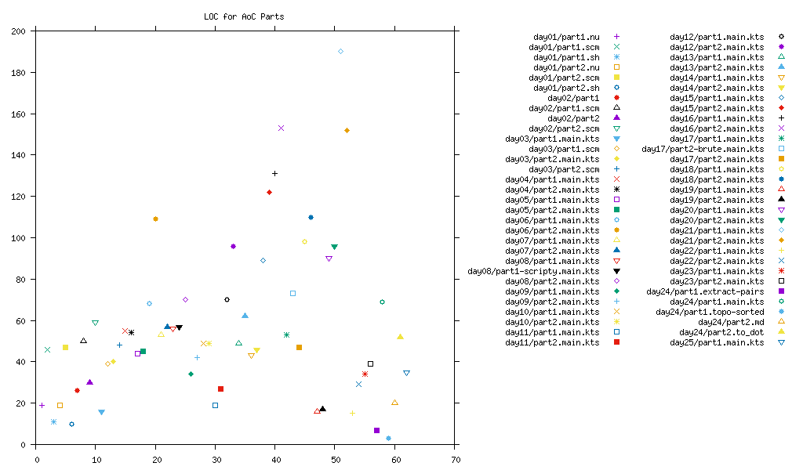

Advent Of Code 2024
===================

This is a collection of attempts at the [AoC 2024 puzzles](https://adventofcode.com/2024).

You can run each part of each day with the desired input:

```bash
day01/part1 < day01/example.txt
day01/part1 < day01/input.txt
```

Structure
---------

Each day has a directory:

```
├── day01/
├── day02/
├── day../
└── README.md
```

Each day's directory contains the example input(s), as `example.txt` etc., and an executable script for each part, `part1` and `part2` respectively:

```
├── day../
│   ├── example.txt
│   ├── input.txt
│   ├── part1
│   ├── part2
│   ├── ...
│   └── README.md
└── README.md
```

Solution lengths
----------------

Here's how many lines of code it's taking me for the solutions that I've completed:


